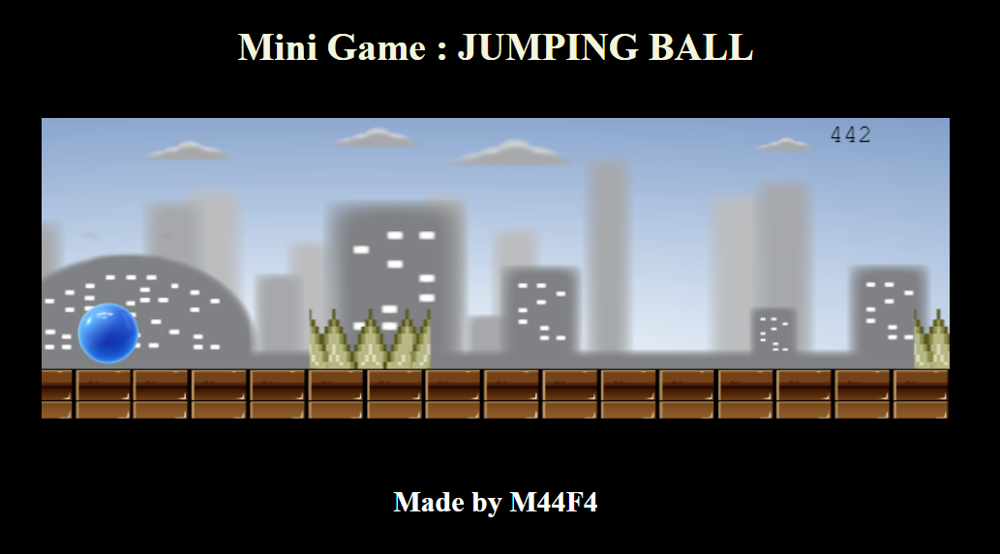

# Jumping Ball Mini-Game

This project is a web-based mini-game inspired by the Chrome dinosaur game, featuring a jumping ball as the main character. It was created following a course from freeCodeCamp on YouTube, which you can watch here :

 [JavaScript Game Development Course for Beginners](https://youtu.be/GFO_txvwK_c?si=Vz137ECtLT0-MbIb).


## Preview



## Installation

To run the game locally, follow these steps:

1. Clone the repository:
```sh
git clone https://github.com/M44F4/Web-mini-projects-Collection JumpingBall
```

2. Open the project folder in your code editor.
3. Open the `index.html` file in your web browser to play the game.

## Usage

- Press the spacebar to make the ball jump.
- Avoid obstacles to keep the game going.
- See how far you can go and try to beat your high score!

## Assets

The assets used in this project are mostly modified versions of assets used in the freeCodeCamp tutorial. Original assets from the tutorial can be downloaded from their Project 2 assets: 

[Parallax backgrounds with JavaScript Layers Zip](https://www.youtube.com/redirect?event=video_description&redir_token=QUFFLUhqbmRzYVZWQlotVC1LMF95SWtVbTZGZHVKNTI3UXxBQ3Jtc0tsS19ydmtubTNSVEVXdWRmSUVNdXNwZC1xRmczTkNXbVBIb3BuQTJUVFFDRjdCdmp4LXJ5SlAxbmxXSlVEUlFjT1RocmpCSFVGTFNEWDZwRXlvaG1SNXVCLUZPcUZnOEpZd244clVJSUF6akVCbklQaw&q=https%3A%2F%2Ffrankslaboratory.co.uk%2Fdownloads%2FbackgroundLayers.zip).

## Contributing

Contributions to this project are welcome! If you have any ideas for improvements or new features, please submit a pull request.

## Credits

- This project was created following a tutorial from freeCodeCamp on YouTube.
- Modified assets used in this project are based on assets from the tutorial.

## License

This project is licensed under the [MIT License](LICENSE).
